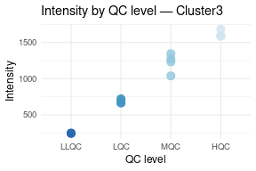
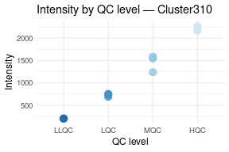
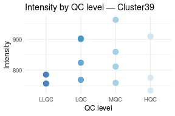
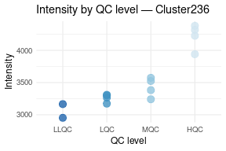
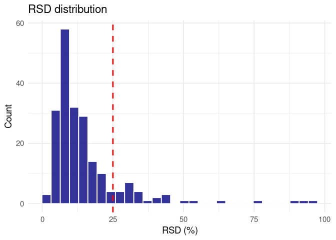

Cluster Filtering in Peak Table
================
Tecla Duran Fort
2025-12-15

- <a href="#load-data" id="toc-load-data">Load Data</a>
- <a href="#1-filter-by-representation-across-samples"
  id="toc-1-filter-by-representation-across-samples">1. Filter By
  Representation Across Samples</a>
  - <a href="#defining-a-threshold-20"
    id="toc-defining-a-threshold-20">Defining a threshold (20%)</a>
  - <a href="#exclude-them-drom-the-datasets"
    id="toc-exclude-them-drom-the-datasets">Exclude them drom the
    datasets</a>
- <a href="#2-filter-by-qc-stability" id="toc-2-filter-by-qc-stability">2.
  Filter By QC Stability</a>
  - <a href="#exclude-target-analytes"
    id="toc-exclude-target-analytes">Exclude target analytes</a>
  - <a href="#distribution-of-rsd-values"
    id="toc-distribution-of-rsd-values">Distribution of RSD Values</a>
  - <a href="#filter-clusters-with-rsd--25-in-qc"
    id="toc-filter-clusters-with-rsd--25-in-qc">Filter clusters with RSD
    &gt; 25 in QC</a>
- <a href="#list-of-excluded-clusters"
  id="toc-list-of-excluded-clusters">List of excluded clusters</a>
- <a href="#save-filtered-peak-table"
  id="toc-save-filtered-peak-table">Save Filtered Peak Table</a>

# Load Data

    ## Data from: data/raw/tgn_results_gcims/urine/results_2025-12-15_16-59

# 1. Filter By Representation Across Samples

## Defining a threshold (20%)

``` r
rare_clusters <- representation_df %>%
  filter(representation_ratio < 0.2) %>%
  pull(cluster)
```

    ## Number of rare clusters: 151

## Exclude them drom the datasets

``` r
data_filtered <- data %>%
  select(-any_of(rare_clusters))

peak_table_duplicity_filtered <- peak_table_duplicity %>%
  select(-any_of(rare_clusters))

patient_data_filtered <- patient_data %>%
  select(-any_of(rare_clusters))

qcs_filtered <- qcs %>%
  select(-any_of(rare_clusters))
```

# 2. Filter By QC Stability

## Exclude target analytes

Some analytes (anisole, 2-pentanone, 2-heptanone — monomer and dimer
forms) were intentionally added to the QC samples as targets. They are
excluded from the stability analysis since they are not supposed to stay
constant across QC levels.

<!-- --><!-- --><!-- --><!-- --><!-- -->

## Distribution of RSD Values

``` r
rsd_qc <- qcs_filtered %>%
  pivot_longer(cols = starts_with("Cluster"), names_to = "Cluster", values_to = "Intensity") %>%
  filter(!Cluster %in% excluded_names) %>% 
  group_by(Cluster) %>%
  summarise(
    mean_int = mean(Intensity, na.rm = TRUE),
    sd_int = sd(Intensity, na.rm = TRUE),
    rsd = (sd_int / mean_int) * 100,
    .groups = "drop"
  )
```

<!-- -->

## Filter clusters with RSD \> 25 in QC

Clusters with RSD above 30% in the QC samples are considered unstable
and removed from further analysis.

``` r
high_rsd_clusters <- rsd_qc %>%
  filter(rsd > 25) %>%
  pull(Cluster)
```

# List of excluded clusters

``` r
excluded_total <- unique(c(rare_clusters, high_rsd_clusters))
```

    ## Summary of cluster exclusions:

    ##  - Due to low representation (<20%): 151

    ##  - Due to high RSD in QC (>25%): 30

# Save Filtered Peak Table
