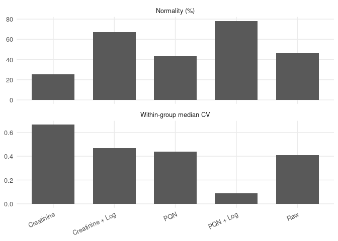
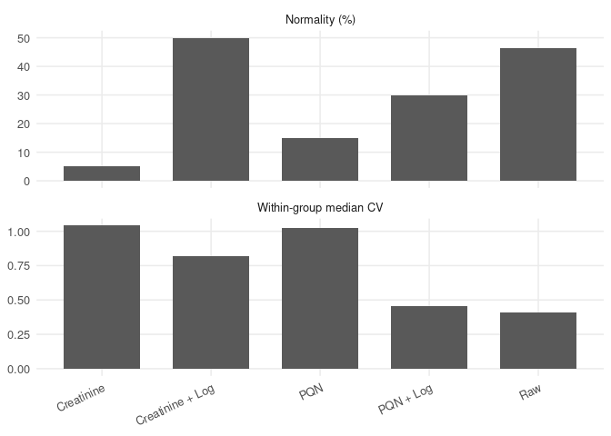

Check of Preprocessing of Tarragona Samples
================
Tecla Duran Fort
2025-12-22

- <a href="#1-set-up" id="toc-1-set-up">1 Set Up</a>
- <a href="#2-load-data" id="toc-2-load-data">2 Load Data</a>
- <a href="#3-functions-definition" id="toc-3-functions-definition">3
  Functions Definition</a>
- <a href="#4-gc-ims-data" id="toc-4-gc-ims-data">4 GC-IMS Data</a>
  - <a href="#41-transformations" id="toc-41-transformations">4.1
    Transformations</a>
    - <a href="#411-pqn-normalization" id="toc-411-pqn-normalization">4.1.1
      PQN Normalization</a>
    - <a href="#412-creatinine-normalization"
      id="toc-412-creatinine-normalization">4.1.2 Creatinine Normalization</a>
    - <a href="#413-log-transformation" id="toc-413-log-transformation">4.1.3
      Log Transformation</a>
  - <a href="#42-evaluation" id="toc-42-evaluation">4.2 Evaluation</a>
- <a href="#5-targeted-data" id="toc-5-targeted-data">5 Targeted Data</a>
  - <a href="#51-transformations" id="toc-51-transformations">5.1
    Transformations</a>
    - <a href="#511-pqn-normalization" id="toc-511-pqn-normalization">5.1.1
      PQN Normalization</a>
    - <a href="#512-creatinine-normalization"
      id="toc-512-creatinine-normalization">5.1.2 Creatinine Normalization</a>
    - <a href="#513-log-transformation" id="toc-513-log-transformation">5.1.3
      Log Transformation</a>
  - <a href="#52-evaluation" id="toc-52-evaluation">5.2 Evaluation</a>

In this file we explore how the dataset evolves when applying the
different normalizations and transformations. As a “figure of merit” we
explore the number of features that have a normal distribution in each
of the groups of patients, based on a Shapiro-Wilks p-value.

# 1 Set Up

# 2 Load Data

``` r
data_gcims <- read_csv("data/tables/tgn_gcims/peak_table_filtered_all_samples.csv")
data_gcims_patients<- data_gcims%>%filter(matrix=="urine")%>%dplyr::select(-matrix,-control_level,-day)
creatinine<- read_csv("data/tables/tgn/creatinine.csv") 
cluster_cols <- grep("^Cluster", names(data_gcims), value = TRUE)

data_targeted <- readRDS(file.path("data/additional_objects", "targeted_data.rds"))
```

# 3 Functions Definition

``` r
# Function to check normality (Shapiro)
check_normal <- function(x) {
  x <- x[!is.na(x)]
  if (length(x) < 3) return(NA)
  shapiro.test(x)$p.value
} 

median_cv_within_group <- function(df, x_cols, group_col) {
  groups <- unique(df[[group_col]])

  per_group <- purrr::map_dbl(groups, function(g) {
    sub <- df[df[[group_col]] == g, , drop = FALSE]

    cvs <- purrr::map_dbl(x_cols, function(cl) {
      v <- sub[[cl]]
      v <- v[is.finite(v)]
      if (length(v) < 3) return(NA_real_)
      m <- mean(v, na.rm = TRUE)
      s <- stats::sd(v, na.rm = TRUE)
      if (!is.finite(m) || m == 0) return(NA_real_)
      s / abs(m)
    })

    stats::median(cvs, na.rm = TRUE)
  })

  mean(per_group, na.rm = TRUE)
}

evaluate_pipeline <- function(df, name, x_cols = NULL, group_col = "patient_condition") {

  if (is.null(x_cols) || length(x_cols) == 0) {
    x_cols <- get_x_cols(df)
  }

  # Safety check
  if (length(x_cols) == 0) {
    warning(paste("No numeric features found for pipeline:", name))
    return(
      tibble::tibble(
        pipeline = name,
        normality_pct = NA_real_,
        median_cv_within_group = NA_real_
      )
    )
  }

  conditions <- unique(df[[group_col]])

  # ---- NORMALITY ----
  pvals <- purrr::map(x_cols, function(cl) {
    purrr::map_dbl(conditions, function(cond) {
      vals <- df[df[[group_col]] == cond, cl, drop = TRUE]
      check_normal(vals)
    })
  }) %>% unlist()

  normality_pct <- mean(pvals > 0.05, na.rm = TRUE) * 100

  # ---- DISPERSION ----
  med_cv <- median_cv_within_group(df, x_cols, group_col)

  tibble::tibble(
    pipeline = name,
    normality_pct = normality_pct,
    median_cv_within_group = med_cv
  )
}
```

# 4 GC-IMS Data

## 4.1 Transformations

### 4.1.1 PQN Normalization

A reference spectrum is required for PQN normalization.  
Here, the **median spectrum of all control samples** is used as
reference.

The **target analytes** (Anisole, 2-Heptanone (Monomer, Dimer),
2-Pentanone (Monomer, Dimer)) are intentionally excluded because the QC
samples include **different concentration levels of these compounds**.  
The identification of these target analytes is detailed in the following
document:  
[Identification of Target Analytes – Tarragona Urine
Measurements](https://github.com/tecladuran/targetml-workflows/blob/main/docs/measurements_tarragona/preprocessing/identification/identification_tgn_urine.md)

``` r
# Reference spectrum computation

# Clusters corresponding to target analytes
excluded_clusters <- c(3, 155, 310, 39, 236)
excluded_names <- paste0("Cluster", excluded_clusters)

# Compute the reference (median) spectrum using control samples only
ref_spectrum <- data_gcims %>%
  filter(class == "control") %>%
  select(starts_with("Cluster")) %>%
  select(-any_of(excluded_names)) %>%
  summarise(across(everything(), median, na.rm = TRUE)) %>%
  as.numeric()

# Assign column names to the numeric vector for later reference
names(ref_spectrum) <- colnames(
  data_gcims %>%
    select(starts_with("Cluster")) %>%
    select(-any_of(excluded_names))
)
```

The **Probabilistic Quotient Normalization (PQN)** corrects for dilution
or total intensity differences between samples. For each sample:

1.  The quotient between its spectrum and the reference spectrum is
    computed.
2.  The **median of the quotients** gives the normalization factor *f*.
3.  All intensities in that sample are divided by *f*.

``` r
# Normalization

data_pqn <- data_gcims %>%
  mutate(across(starts_with("Cluster"), as.numeric)) %>%
  group_split(row_number()) %>%                     # Split into individual samples
  map_dfr(function(row_df) {
    # Extract numeric cluster values for the current sample
    x <- as.numeric(row_df %>%
                      select(starts_with("Cluster")) %>%
                      select(-any_of(excluded_names)))
    
    # Compute the ratio between sample and reference spectrum
    quotients <- x / ref_spectrum
    quotients <- quotients[is.finite(quotients)]    # Remove non-finite values
    
    # Median of quotients = normalization factor
    f <- median(quotients, na.rm = TRUE)
    
    # Apply normalization and store the factor
    row_df %>%
      mutate(across(starts_with("Cluster"), ~ .x / f),
             PQN_factor = f)
  })
```

### 4.1.2 Creatinine Normalization

``` r
creatinine <- creatinine %>%
  slice(1:(n() - 2)) %>%         
  mutate(ID = as.numeric(ID))%>%
  rename(Creatinine = Creatinine_mg_dl)

# Join by patient_id
df <- data_gcims_patients %>%
  left_join(creatinine, by = c("patient_id" = "ID"))
```

``` r
# Normalise cluster intensities by creatinine
df_creatinine_norm <- df %>%
  mutate(across(all_of(cluster_cols), ~ .x / Creatinine))
```

### 4.1.3 Log Transformation

#### 4.1.3.1 PQN + Log

``` r
# ---- LOG-TRANSFORM ----
data_pqn_log <- df_pqn_norm
data_pqn_log[cluster_cols] <- log1p(data_pqn_log[cluster_cols])
```

#### 4.1.3.2 Creatinine + Log

``` r
# ---- LOG-TRANSFORM ----
data_creatinine_log <- df_creatinine_norm
data_creatinine_log[cluster_cols] <- log1p(data_creatinine_log[cluster_cols])
```

## 4.2 Evaluation

| pipeline         | normality_pct | median_cv_within_group |
|:-----------------|--------------:|-----------------------:|
| Raw              |         46.47 |                   0.41 |
| PQN              |         43.21 |                   0.44 |
| PQN + Log        |         78.26 |                   0.09 |
| Creatinine       |         25.54 |                   0.66 |
| Creatinine + Log |         67.12 |                   0.47 |

Evaluation of preprocessing strategies based on distributional
properties and within-group variability

``` r
eval_long <- eval_table %>%
  tidyr::pivot_longer(
    cols = c(normality_pct, median_cv_within_group),
    names_to = "metric",
    values_to = "value"
  ) %>%
  dplyr::mutate(
    metric = dplyr::recode(metric,
      normality_pct = "Normality (%)",
      median_cv_within_group = "Within-group median CV"
    )
  )

ggplot(eval_long, aes(x = pipeline, y = value)) +
  geom_col(width = 0.7) +
  facet_wrap(~ metric, scales = "free_y", ncol = 1) +
  theme_minimal(base_size = 12) +
  theme(
    axis.text.x = element_text(angle = 25, hjust = 1),
    panel.grid.minor = element_blank()
  ) +
  labs(x = NULL, y = NULL)
```

<!-- -->

# 5 Targeted Data

## 5.1 Transformations

### 5.1.1 PQN Normalization

``` r
ref_spectrum <- data_targeted%>%
  dplyr::select(-patient_id, -patient_condition) %>%
  summarise(across(everything(), median, na.rm = TRUE)) %>%
  as.numeric()
```

``` r
df_pqn_norm <- data_targeted %>%
  mutate(across(-c(patient_id, patient_condition), as.numeric)) %>%
  rowwise() %>%
  mutate(
    PQN_factor = {
      x <- c_across(-c(patient_id, patient_condition))
      quotients <- x / ref_spectrum
      quotients <- quotients[is.finite(quotients)]
      median(quotients, na.rm = TRUE)
    }
  ) %>%
  mutate(
    across(-c(patient_id, PQN_factor, patient_condition), ~ .x / PQN_factor)
  ) %>%
  ungroup()%>% select(-PQN_factor)
```

### 5.1.2 Creatinine Normalization

``` r
# Join by patient_id
df_creatinine <- data_targeted %>%
  left_join(creatinine, by = c("patient_id" = "ID"))
```

``` r
# Normalise cluster intensities by creatinine
df_creatinine_norm <- df_creatinine %>%
  mutate(across(-c(patient_id, patient_condition, Creatinine), ~ .x / Creatinine))%>%
  select(-Creatinine)
```

### 5.1.3 Log Transformation

#### 5.1.3.1 PQN + Log

``` r
# ---- LOG-TRANSFORM ----
data_pqn_log<- df_pqn_norm %>%
  mutate(across(-c(patient_id, patient_condition), log1p))
```

#### 5.1.3.2 Creatinine + Log

``` r
# ---- LOG-TRANSFORM ----
data_creatinine_log <- df_creatinine_norm %>%
  mutate(across(-c(patient_id,patient_condition), log1p))
```

## 5.2 Evaluation

| pipeline         | normality_pct | median_cv_within_group |
|:-----------------|--------------:|-----------------------:|
| Raw              |         46.47 |                   0.41 |
| PQN              |         15.00 |                   1.02 |
| PQN + Log        |         30.00 |                   0.45 |
| Creatinine       |          5.00 |                   1.04 |
| Creatinine + Log |         50.00 |                   0.82 |

Evaluation of preprocessing strategies based on distributional
properties and within-group variability

``` r
eval_long <- eval_table %>%
  tidyr::pivot_longer(
    cols = c(normality_pct, median_cv_within_group),
    names_to = "metric",
    values_to = "value"
  ) %>%
  dplyr::mutate(
    metric = dplyr::recode(metric,
      normality_pct = "Normality (%)",
      median_cv_within_group = "Within-group median CV"
    )
  )

ggplot(eval_long, aes(x = pipeline, y = value)) +
  geom_col(width = 0.7) +
  facet_wrap(~ metric, scales = "free_y", ncol = 1) +
  theme_minimal(base_size = 12) +
  theme(
    axis.text.x = element_text(angle = 25, hjust = 1),
    panel.grid.minor = element_blank()
  ) +
  labs(x = NULL, y = NULL)
```

<!-- -->
