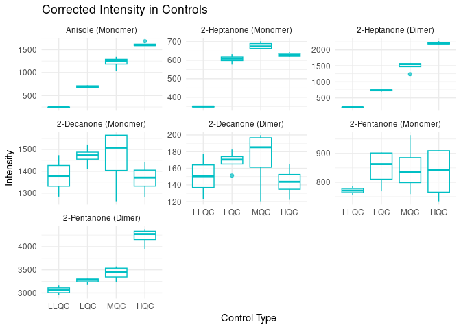
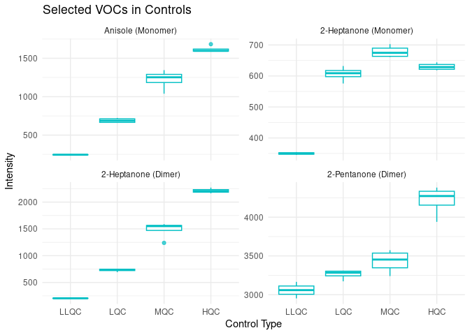

VOC Identification in Tarragona Measurements
================
Tecla Duran Fort
2025-12-15

- <a href="#load-data" id="toc-load-data">Load Data</a>
- <a href="#target-vocs" id="toc-target-vocs">Target VOCs</a>
- <a href="#identification" id="toc-identification">Identification</a>
- <a href="#manual-corrections" id="toc-manual-corrections">Manual
  Corrections</a>
- <a href="#relevant-peak-tables" id="toc-relevant-peak-tables">Relevant
  Peak Tables</a>
- <a href="#plot" id="toc-plot">Plot</a>
- <a href="#save" id="toc-save">Save</a>

``` r
library(openxlsx)
library(dplyr)
```

    ## 
    ## Attaching package: 'dplyr'

    ## The following objects are masked from 'package:stats':
    ## 
    ##     filter, lag

    ## The following objects are masked from 'package:base':
    ## 
    ##     intersect, setdiff, setequal, union

``` r
library(reshape2)
library(ggplot2)
library(rprojroot)
knitr::opts_knit$set(root.dir = rprojroot::find_root(rprojroot::is_git_root))
source("../../../../load_tools.R")
```

    ## here() starts at /storage/users/tduran/Projects/targetml-workflows

    ## >>> loading tools...
    ## [1] "/storage/users/tduran/Projects/targetml-workflows/R/baseline.R"          
    ## [2] "/storage/users/tduran/Projects/targetml-workflows/R/ML_PAR.R"            
    ## [3] "/storage/users/tduran/Projects/targetml-workflows/R/quantification.R"    
    ## [4] "/storage/users/tduran/Projects/targetml-workflows/R/setup.R"             
    ## [5] "/storage/users/tduran/Projects/targetml-workflows/R/utils_gcims.R"       
    ## [6] "/storage/users/tduran/Projects/targetml-workflows/R/utils.R"             
    ## [7] "/storage/users/tduran/Projects/targetml-workflows/R/voc_identification.R"
    ## → Sourcing: /storage/users/tduran/Projects/targetml-workflows/R/baseline.R 
    ## → Sourcing: /storage/users/tduran/Projects/targetml-workflows/R/ML_PAR.R 
    ## → Sourcing: /storage/users/tduran/Projects/targetml-workflows/R/quantification.R 
    ## → Sourcing: /storage/users/tduran/Projects/targetml-workflows/R/setup.R 
    ## → Sourcing: /storage/users/tduran/Projects/targetml-workflows/R/utils_gcims.R 
    ## → Sourcing: /storage/users/tduran/Projects/targetml-workflows/R/utils.R 
    ## → Sourcing: /storage/users/tduran/Projects/targetml-workflows/R/voc_identification.R

## Load Data

    ## Results: data/raw/tgn_results_gcims/urine/results_2025-12-15_11-05

## Target VOCs

## Identification

    ## Warning in identify_target_vocs(cluster_stats, target_vocs, max_distance = 0.2, : Unreliable matches found for the following VOCs:
    ## - 2-Decanone (Monomer)
    ## - 2-Decanone (Dimer)
    ## 
    ## These VOCs were matched to the closest cluster despite exceeding the `max_distance` threshold.
    ## You may want to:
    ## - Use `modify_voc_assignment(results, voc_name, new_cluster, cluster_stats)` to manually correct a match.
    ## - Use `remove_voc(results, voc_name)` to remove a VOC from the results.

``` r
relevant_clusters
```

    ##                compound     dt      rt    cluster dt_apex_ms rt_apex_s
    ## 1     Anisole (Monomer)  8.692  446.45   Cluster3   8.733333   444.150
    ## 2 2-Heptanone (Monomer) 10.300  414.62 Cluster155  10.400000   416.115
    ## 3   2-Heptanone (Dimer) 13.500  415.75 Cluster310  13.453333   415.170
    ## 4  2-Decanone (Monomer) 12.099 1520.00 Cluster280  12.186667  1540.455
    ## 5    2-Decanone (Dimer) 16.296 1520.00 Cluster363  16.453333  1541.400
    ## 6 2-Pentanone (Monomer)  9.200  228.24  Cluster39   9.240000   227.115
    ## 7   2-Pentanone (Dimer) 11.200  229.24 Cluster236  11.306667   226.590
    ##     distance reliable_match
    ## 1 0.06184209           TRUE
    ## 2 0.10437437           TRUE
    ## 3 0.04808677           TRUE
    ## 4 0.41838768          FALSE
    ## 5 0.45600195          FALSE
    ## 6 0.04589390           TRUE
    ## 7 0.11910826           TRUE

## Manual Corrections

``` r
# Example:
# relevant_clusters <- modify_voc_assignment(relevant_clusters, "2-Heptanone (Dimer)", "ClusterXYZ", cluster_stats, ratio = 1/50)
```

## Relevant Peak Tables

## Plot

<!-- -->

Select only the ones that we can see clearly that they are well
identified (at the end we only need anisole and heptanone dimer)

<!-- -->

## Save
