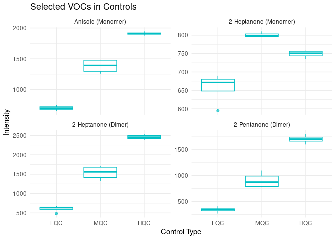

- <a href="#load-data" id="toc-load-data">Load Data</a>
- <a href="#target-vocs" id="toc-target-vocs">Target VOCs</a>
- <a href="#identification" id="toc-identification">Identification</a>
- <a href="#manual-corrections" id="toc-manual-corrections">Manual
  Corrections</a>
- <a href="#relevant-peak-tables" id="toc-relevant-peak-tables">Relevant
  Peak Tables</a>
- <a href="#plot" id="toc-plot">Plot</a>
- <a href="#save" id="toc-save">Save</a>

``` r
library(openxlsx)
source("../../../load_targetml_tools.R")
```

    ## here() starts at /storage/users/tduran/Projects/targetml-gcims-tools

    ## 
    ## Attaching package: 'dplyr'

    ## The following objects are masked from 'package:stats':
    ## 
    ##     filter, lag

    ## The following objects are masked from 'package:base':
    ## 
    ##     intersect, setdiff, setequal, union

    ## >>> loading tools...
    ## [1] "/storage/users/tduran/Projects/targetml-gcims-tools/R/baseline_exploratory.R"
    ## [2] "/storage/users/tduran/Projects/targetml-gcims-tools/R/baseline.R"            
    ## [3] "/storage/users/tduran/Projects/targetml-gcims-tools/R/cal_curves.R"          
    ## [4] "/storage/users/tduran/Projects/targetml-gcims-tools/R/optimize_alignment.R"  
    ## [5] "/storage/users/tduran/Projects/targetml-gcims-tools/R/quantification.R"      
    ## [6] "/storage/users/tduran/Projects/targetml-gcims-tools/R/utils_gcims.R"         
    ## [7] "/storage/users/tduran/Projects/targetml-gcims-tools/R/utils_tdf.R"           
    ## [8] "/storage/users/tduran/Projects/targetml-gcims-tools/R/voc_identification.R"  
    ## → Sourcing: /storage/users/tduran/Projects/targetml-gcims-tools/R/baseline_exploratory.R 
    ## → Sourcing: /storage/users/tduran/Projects/targetml-gcims-tools/R/baseline.R 
    ## → Sourcing: /storage/users/tduran/Projects/targetml-gcims-tools/R/cal_curves.R 
    ## → Sourcing: /storage/users/tduran/Projects/targetml-gcims-tools/R/optimize_alignment.R 
    ## → Sourcing: /storage/users/tduran/Projects/targetml-gcims-tools/R/quantification.R 
    ## → Sourcing: /storage/users/tduran/Projects/targetml-gcims-tools/R/utils_gcims.R

    ## 
    ## Attaching package: 'gridExtra'

    ## The following object is masked from 'package:dplyr':
    ## 
    ##     combine

    ## → Sourcing: /storage/users/tduran/Projects/targetml-gcims-tools/R/utils_tdf.R

    ## 
    ## Attaching package: 'patchwork'

    ## The following object is masked from 'package:cowplot':
    ## 
    ##     align_plots

    ## → Sourcing: /storage/users/tduran/Projects/targetml-gcims-tools/R/voc_identification.R

``` r
library(dplyr)
library(reshape2)
library(ggplot2)
```

## Load Data

## Target VOCs

## Identification

    ## Warning in identify_target_vocs(cluster_stats, target_vocs, max_distance = 0.2, : Unreliable matches found for the following VOCs:
    ## - 2-Decanone (Monomer)
    ## - 2-Decanone (Dimer)
    ## 
    ## These VOCs were matched to the closest cluster despite exceeding the `max_distance` threshold.
    ## You may want to:
    ## - Use `modify_voc_assignment(results, voc_name, new_cluster, cluster_stats)` to manually correct a match.
    ## - Use `remove_voc(results, voc_name)` to remove a VOC from the results.

``` r
relevant_clusters
```

    ##                compound     dt      rt   cluster dt_apex_ms rt_apex_s
    ## 1     Anisole (Monomer)  8.692  446.45  Cluster1   8.706667   445.620
    ## 2 2-Heptanone (Monomer) 10.300  414.62 Cluster32  10.386667   420.000
    ## 3   2-Heptanone (Dimer) 13.500  415.75 Cluster74  13.440000   417.270
    ## 4  2-Decanone (Monomer) 12.099 1520.00 Cluster69  12.173333  1543.710
    ## 5    2-Decanone (Dimer) 16.296 1520.00 Cluster86  16.413333  1543.395
    ## 6 2-Pentanone (Monomer)  9.200  228.24  Cluster8   9.226667   228.375
    ## 7   2-Pentanone (Dimer) 11.200  229.24 Cluster52  11.293333   228.165
    ##     distance reliable_match
    ## 1 0.02215110           TRUE
    ## 2 0.13816248           TRUE
    ## 3 0.06726188           TRUE
    ## 4 0.47999071          FALSE
    ## 5 0.48238731          FALSE
    ## 6 0.02680301           TRUE
    ## 7 0.09577766           TRUE

## Manual Corrections

``` r
# Example:
# relevant_clusters <- modify_voc_assignment(relevant_clusters, "2-Heptanone (Dimer)", "ClusterXYZ", cluster_stats, ratio = 1/50)
```

## Relevant Peak Tables

## Plot

<!-- -->
Select only the ones the 4 that we selected in urine (see doc
identification_tgn_urine.html).

<!-- -->

## Save
