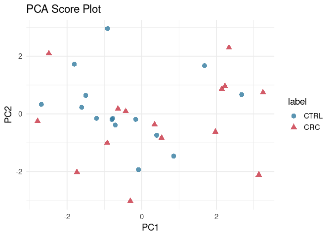

Full Targeted Analysis of Tarragona Samples
================
Tecla Duran Fort
2025-12-15

- <a href="#1-set-up" id="toc-1-set-up">1 Set Up</a>
- <a href="#2-load-data" id="toc-2-load-data">2 Load Data</a>
  - <a href="#21-gcims-data" id="toc-21-gcims-data">2.1 GCIMS Data</a>
  - <a href="#22-tgn-data" id="toc-22-tgn-data">2.2 TGN Data</a>
  - <a href="#23-metadata" id="toc-23-metadata">2.3 Metadata</a>
  - <a href="#24-creatinine-data" id="toc-24-creatinine-data">2.4 Creatinine
    Data</a>
- <a href="#3-preprocessing" id="toc-3-preprocessing">3 Preprocessing</a>
  - <a href="#31-gcims-quantification" id="toc-31-gcims-quantification">3.1
    GCIMS Quantification</a>
  - <a href="#32-tgn-data-imputation" id="toc-32-tgn-data-imputation">3.2
    TGN Data Imputation</a>
  - <a href="#33-data-merge" id="toc-33-data-merge">3.3 Data Merge</a>
  - <a href="#34-creatinine-normalisation"
    id="toc-34-creatinine-normalisation">3.4 Creatinine Normalisation</a>
  - <a href="#35-log-transformation" id="toc-35-log-transformation">3.5 Log
    Transformation</a>
- <a href="#4-exploratory-analysis" id="toc-4-exploratory-analysis">4
  Exploratory Analysis</a>
- <a href="#5-classification-performance"
  id="toc-5-classification-performance">5 Classification Performance</a>
  - <a href="#51-adding-metadata-as-predictors"
    id="toc-51-adding-metadata-as-predictors">5.1 Adding Metadata as
    Predictors</a>
  - <a href="#52-evaluation" id="toc-52-evaluation">5.2 Evaluation</a>

# 1 Set Up

# 2 Load Data

## 2.1 GCIMS Data

The loaded dataset contains the GCIMS intensity for Anisole and
2-Heptanone in the **patient samples**. The correspondence between the
clusters and the analytes can be checked at the $$Identification
Report$$ (link)

| SampleID          | patient_id |   anisole | heptanone |
|:------------------|-----------:|----------:|----------:|
| 250519_161058.mea |        247 |  45.77928 | 126.70530 |
| 250519_182051.mea |        325 |  47.64092 |  88.55187 |
| 250519_192549.mea |        327 | 330.35749 | 300.79998 |
| 250519_203045.mea |        361 |  49.00386 | 108.53272 |
| 250519_234535.mea |        370 |  46.53451 | 133.74005 |
| 250520_005033.mea |        380 | 156.69138 |  77.33731 |

## 2.2 TGN Data

| patient_id |   Hexanal | 2-heptanone | Heptaldehyde | Dimethyl-trisulfide |  p-cresol | 2-nonanone | levomenthol | alpha-terpineol |   Indole | 2-methoxy-4-vinylphenol |
|-----------:|----------:|:------------|-------------:|--------------------:|----------:|-----------:|------------:|----------------:|---------:|------------------------:|
|       1062 | 600.92732 | NA          |     39.55431 |                  NA | 269.06893 |  0.7856962 |          NA |       0.5980023 | 179.9848 |               11524.363 |
|        327 | 591.96270 | NA          |     33.62182 |                  NA |  44.06896 |  0.5441778 |          NA |      60.4786722 | 183.0378 |               45136.574 |
|        361 |  75.75845 | NA          |     34.55816 |           37.849955 | 486.28492 |  2.2675518 |          NA |      35.8789135 | 190.3233 |                4174.750 |
|        370 | 801.26190 | NA          |     35.71911 |           63.440891 | 119.78931 |  0.5310189 |          NA |     189.0379805 | 188.6491 |                5426.580 |
|        380 |  88.05058 | NA          |     32.48434 |                  NA | 160.51035 |  1.9039815 |          NA |              NA | 179.1291 |                3144.381 |
|        401 |  49.34575 | NA          |     46.71404 |            9.636087 | 471.32483 |  4.1797535 |          NA |              NA | 197.8210 |                4967.546 |

## 2.3 Metadata

| patient_id | condition | sex | age |      bmi |
|-----------:|:----------|:----|----:|---------:|
|        247 | CRC       | M   |  59 | 25.86451 |
|        325 | CRC       | F   |  65 | 32.00732 |
|        327 | CRC       | F   |  51 | 24.53896 |
|        361 | CTRL      | F   |  55 | 22.81639 |
|        370 | CTRL      | M   |  52 | 34.06361 |
|        380 | CTRL      | M   |  65 | 30.84442 |

## 2.4 Creatinine Data

|  ID | Creatinine |
|----:|-----------:|
| 247 |     223.30 |
| 325 |      28.52 |
| 327 |     131.30 |
| 361 |     171.13 |
| 370 |     256.95 |
| 380 |      85.33 |

# 3 Preprocessing

## 3.1 GCIMS Quantification

| patient_id | anisole_gcims | heptanone_gcims |
|-----------:|--------------:|----------------:|
|        247 |     0.4170667 |       0.8298337 |
|        325 |     0.4342028 |       0.5763852 |
|        327 |     3.1991283 |       2.0289467 |
|        361 |     0.4467485 |       0.7087106 |
|        370 |     0.4240184 |       0.8768827 |
|        380 |     1.4601276 |       0.5024324 |

## 3.2 TGN Data Imputation

    ## # A tibble: 6 × 3
    ##   compound            LOQ_ppb sigma
    ##   <chr>                 <dbl> <dbl>
    ## 1 Hexanal               25    2.5  
    ## 2 2-heptanone           10    1    
    ## 3 Heptaldehyde          10    1    
    ## 4 Dimethyl-trisulfide    0.75 0.075
    ## 5 p-cresol              25    2.5  
    ## 6 2-nonanone             5    0.5

| patient_id |   Hexanal | Heptaldehyde | Dimethyl-trisulfide |  p-cresol | 2-nonanone | alpha-terpineol |   Indole | 2-methoxy-4-vinylphenol |
|-----------:|----------:|-------------:|--------------------:|----------:|-----------:|----------------:|---------:|------------------------:|
|       1062 | 600.92732 |     39.55431 |           0.1169031 | 269.06893 |  0.7856962 |       0.5980023 | 179.9848 |               11524.363 |
|        327 | 591.96270 |     33.62182 |           0.0918061 |  44.06896 |  0.5441778 |      60.4786722 | 183.0378 |               45136.574 |
|        361 |  75.75845 |     34.55816 |          37.8499550 | 486.28492 |  2.2675518 |      35.8789135 | 190.3233 |                4174.750 |
|        370 | 801.26190 |     35.71911 |          63.4408906 | 119.78931 |  0.5310189 |     189.0379805 | 188.6491 |                5426.580 |
|        380 |  88.05058 |     32.48434 |           0.0616186 | 160.51035 |  1.9039815 |      -0.0046434 | 179.1291 |                3144.381 |
|        401 |  49.34575 |     46.71404 |           9.6360871 | 471.32483 |  4.1797535 |      -0.0842331 | 197.8210 |                4967.546 |

## 3.3 Data Merge

| patient_id | anisole_gcims | heptanone_gcims |   Hexanal | Heptaldehyde | Dimethyl-trisulfide |  p-cresol | 2-nonanone | alpha-terpineol |   Indole | 2-methoxy-4-vinylphenol |
|-----------:|--------------:|----------------:|----------:|-------------:|--------------------:|----------:|-----------:|----------------:|---------:|------------------------:|
|        247 |     0.4170667 |       0.8298337 | 180.59004 |     38.84897 |          33.2153237 | 293.65491 |  0.3453156 |     459.6800380 | 171.8840 |              10997.3666 |
|        325 |     0.4342028 |       0.5763852 |  14.26629 |     30.15525 |          -0.0945116 |   8.10260 |  0.7372161 |       0.0223671 | 169.1543 |                813.8163 |
|        327 |     3.1991283 |       2.0289467 | 591.96270 |     33.62182 |           0.0918061 |  44.06896 |  0.5441778 |      60.4786722 | 183.0378 |              45136.5737 |
|        361 |     0.4467485 |       0.7087106 |  75.75845 |     34.55816 |          37.8499550 | 486.28492 |  2.2675518 |      35.8789135 | 190.3233 |               4174.7499 |
|        370 |     0.4240184 |       0.8768827 | 801.26190 |     35.71911 |          63.4408906 | 119.78931 |  0.5310189 |     189.0379805 | 188.6491 |               5426.5798 |
|        380 |     1.4601276 |       0.5024324 |  88.05058 |     32.48434 |           0.0616186 | 160.51035 |  1.9039815 |      -0.0046434 | 179.1291 |               3144.3810 |

## 3.4 Creatinine Normalisation

| patient_id | anisole_gcims | heptanone_gcims |   Hexanal | Heptaldehyde | Dimethyl-trisulfide |  p-cresol | 2-nonanone | alpha-terpineol |    Indole | 2-methoxy-4-vinylphenol |
|-----------:|--------------:|----------------:|----------:|-------------:|--------------------:|----------:|-----------:|----------------:|----------:|------------------------:|
|        247 |     0.0018677 |       0.0037162 | 0.8087328 |    0.1739766 |           0.1487475 | 1.3150690 |  0.0015464 |       2.0585761 | 0.7697446 |                49.24929 |
|        325 |     0.0152245 |       0.0202099 | 0.5002205 |    1.0573369 |          -0.0033139 | 0.2841024 |  0.0258491 |       0.0007843 | 5.9310774 |                28.53493 |
|        327 |     0.0243650 |       0.0154528 | 4.5084745 |    0.2560687 |           0.0006992 | 0.3356356 |  0.0041445 |       0.4606144 | 1.3940426 |               343.76675 |
|        361 |     0.0026106 |       0.0041414 | 0.4426953 |    0.2019410 |           0.2211766 | 2.8416112 |  0.0132505 |       0.2096588 | 1.1121560 |                24.39520 |
|        370 |     0.0016502 |       0.0034127 | 3.1183573 |    0.1390119 |           0.2468997 | 0.4661969 |  0.0020666 |       0.7356995 | 0.7341859 |                21.11921 |
|        380 |     0.0171115 |       0.0058881 | 1.0318830 |    0.3806908 |           0.0007221 | 1.8810541 |  0.0223132 |      -0.0000544 | 2.0992506 |                36.84965 |

## 3.5 Log Transformation

``` r
# LOG-TRANSFORM ----
data_log <- df_creatinine_norm %>%
  mutate(across(-patient_id, log1p))

knitr::kable(head(data_log))
```

| patient_id | anisole_gcims | heptanone_gcims |   Hexanal | Heptaldehyde | Dimethyl-trisulfide |  p-cresol | 2-nonanone | alpha-terpineol |    Indole | 2-methoxy-4-vinylphenol |
|-----------:|--------------:|----------------:|----------:|-------------:|--------------------:|----------:|-----------:|----------------:|----------:|------------------------:|
|        247 |     0.0018660 |       0.0037093 | 0.5926265 |    0.1603968 |           0.1386722 | 0.8394395 |  0.0015452 |       1.1179495 | 0.5708352 |                3.916996 |
|        325 |     0.0151098 |       0.0200084 | 0.4056121 |    0.7214124 |          -0.0033194 | 0.2500599 |  0.0255207 |       0.0007840 | 1.9360153 |                3.385574 |
|        327 |     0.0240729 |       0.0153346 | 1.7062877 |    0.2279867 |           0.0006990 | 0.2894073 |  0.0041360 |       0.3788572 | 0.8729834 |                5.842868 |
|        361 |     0.0026072 |       0.0041328 | 0.3665131 |    0.1839377 |           0.1998148 | 1.3458919 |  0.0131634 |       0.1903384 | 0.7477092 |                3.234560 |
|        370 |     0.0016488 |       0.0034068 | 1.4154544 |    0.1301612 |           0.2206603 | 0.3826719 |  0.0020645 |       0.5514105 | 0.5505381 |                3.096446 |
|        380 |     0.0169668 |       0.0058708 | 0.7089630 |    0.3225839 |           0.0007219 | 1.0581562 |  0.0220679 |      -0.0000544 | 1.1311603 |                3.633622 |

# 4 Exploratory Analysis

<!-- -->
\# Statistical Analysis (Wilcoxon Test)

| Compound                | Median_CTRL | Median_CRC | p_Wilcoxon | p_Wilcoxon_adj |
|:------------------------|------------:|-----------:|-----------:|---------------:|
| anisole_gcims           |      0.0018 |     0.0036 |     0.0344 |         0.3400 |
| Heptaldehyde            |      0.2423 |     0.3272 |     0.0680 |         0.3400 |
| Indole                  |      0.9090 |     1.0798 |     0.1249 |         0.4162 |
| Dimethyl-trisulfide     |      0.0007 |     0.0007 |     0.3195 |         0.7988 |
| heptanone_gcims         |      0.0063 |     0.0079 |     0.7716 |         1.0000 |
| Hexanal                 |      0.8361 |     0.9316 |     1.0000 |         1.0000 |
| p-cresol                |      1.2065 |     0.9599 |     0.9669 |         1.0000 |
| 2-nonanone              |      0.0100 |     0.0048 |     0.5897 |         1.0000 |
| alpha-terpineol         |      0.0009 |     0.0077 |     0.7089 |         1.0000 |
| 2-methoxy-4-vinylphenol |      3.2526 |     3.3856 |     0.9669 |         1.0000 |

Wilcoxon rank-sum test per compound: CRC vs CTRL (FDR-adjusted p-values)

# 5 Classification Performance

## 5.1 Adding Metadata as Predictors

| patient_id | anisole_gcims | heptanone_gcims |   Hexanal | Heptaldehyde | Dimethyl-trisulfide |  p-cresol | 2-nonanone | alpha-terpineol |    Indole | 2-methoxy-4-vinylphenol | condition | sex | age |      bmi |
|-----------:|--------------:|----------------:|----------:|-------------:|--------------------:|----------:|-----------:|----------------:|----------:|------------------------:|:----------|----:|----:|---------:|
|        247 |     0.0018660 |       0.0037093 | 0.5926265 |    0.1603968 |           0.1386722 | 0.8394395 |  0.0015452 |       1.1179495 | 0.5708352 |                3.916996 | CRC       |   1 |  59 | 25.86451 |
|        325 |     0.0151098 |       0.0200084 | 0.4056121 |    0.7214124 |          -0.0033194 | 0.2500599 |  0.0255207 |       0.0007840 | 1.9360153 |                3.385574 | CRC       |   0 |  65 | 32.00732 |
|        327 |     0.0240729 |       0.0153346 | 1.7062877 |    0.2279867 |           0.0006990 | 0.2894073 |  0.0041360 |       0.3788572 | 0.8729834 |                5.842868 | CRC       |   0 |  51 | 24.53896 |
|        361 |     0.0026072 |       0.0041328 | 0.3665131 |    0.1839377 |           0.1998148 | 1.3458919 |  0.0131634 |       0.1903384 | 0.7477092 |                3.234560 | CTRL      |   0 |  55 | 22.81639 |
|        370 |     0.0016488 |       0.0034068 | 1.4154544 |    0.1301612 |           0.2206603 | 0.3826719 |  0.0020645 |       0.5514105 | 0.5505381 |                3.096446 | CTRL      |   1 |  52 | 34.06361 |
|        380 |     0.0169668 |       0.0058708 | 0.7089630 |    0.3225839 |           0.0007219 | 1.0581562 |  0.0220679 |      -0.0000544 | 1.1311603 |                3.633622 | CTRL      |   1 |  65 | 30.84442 |
|        401 |     0.0113648 |       0.0060699 | 0.3427594 |    0.3271619 |           0.0768083 | 1.5902404 |  0.0340432 |      -0.0006981 | 0.9703802 |                3.741380 | CRC       |   0 |  56 | 23.14050 |
|        402 |     0.0100399 |       0.0114137 | 0.7840274 |    0.2959466 |          -0.0001846 | 0.9599145 |  0.0070685 |       0.0002012 | 1.0884846 |                2.797191 | CRC       |   1 |  62 | 28.01022 |
|        407 |     0.0013001 |       0.0039330 | 2.2410342 |    0.2623037 |           0.2729892 | 1.9155408 | -0.0010646 |       0.0003857 | 0.7304455 |                1.498556 | CTRL      |   1 |  65 | 28.02768 |
|        411 |     0.0014170 |       0.0299115 | 1.0309793 |    0.2000911 |          -0.0001146 | 0.7540657 |  0.0032190 |       0.2105242 | 0.9213346 |                2.291662 | CRC       |   0 |  53 | 25.39062 |

## 5.2 Evaluation

    ## ### Random Forest Nested CV — GC-IMS Classification 
    ## Overall Leave-One-Out Accuracy: 0.433 
    ## 
    ## 
    ## 
    ## Table: Global Confusion Matrix (Aggregated Across All LOO Iterations).
    ## 
    ## |   |  0|  1|
    ## |:--|--:|--:|
    ## |0  |  7|  8|
    ## |1  |  9|  6|

<!-- -->
