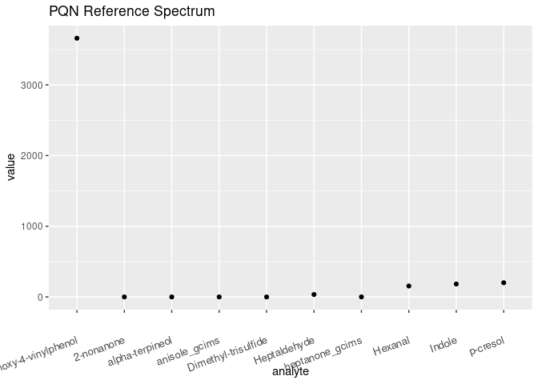
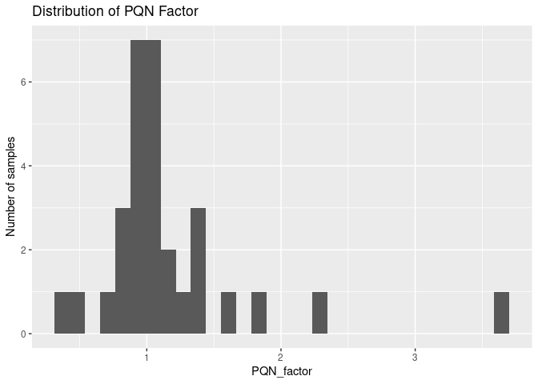
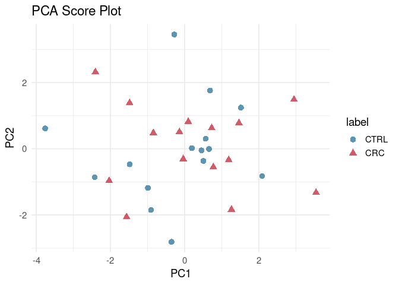
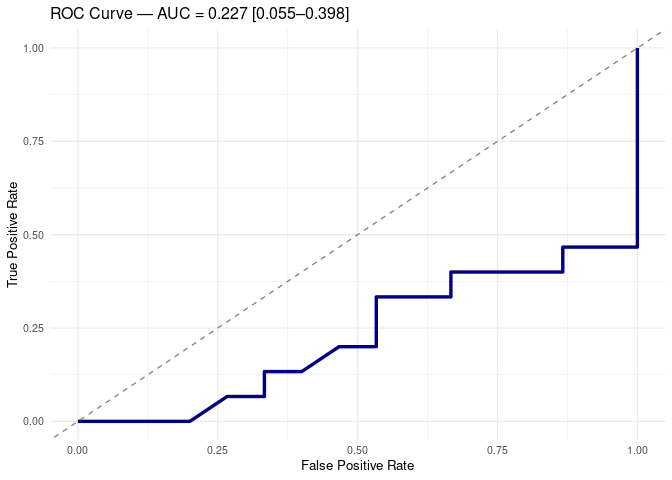

Full Targeted Analysis of Tarragona Samples
================
Tecla Duran Fort
2025-12-15

- <a href="#1-set-up" id="toc-1-set-up">1 Set Up</a>
- <a href="#2-load-data" id="toc-2-load-data">2 Load Data</a>
  - <a href="#21-gcims-data" id="toc-21-gcims-data">2.1 GCIMS Data</a>
  - <a href="#22-tgn-data" id="toc-22-tgn-data">2.2 TGN Data</a>
  - <a href="#23-metadata" id="toc-23-metadata">2.3 Metadata</a>
- <a href="#3-preprocessing" id="toc-3-preprocessing">3 Preprocessing</a>
  - <a href="#31-gcims-quantification" id="toc-31-gcims-quantification">3.1
    GCIMS Quantification</a>
  - <a href="#32-tgn-data-imputation" id="toc-32-tgn-data-imputation">3.2
    TGN Data Imputation</a>
  - <a href="#33-data-merge" id="toc-33-data-merge">3.3 Data Merge</a>
  - <a href="#34-pqn-normalisation" id="toc-34-pqn-normalisation">3.4 PQN
    Normalisation</a>
- <a href="#4-exploratory-analysis" id="toc-4-exploratory-analysis">4
  Exploratory Analysis</a>
- <a href="#5-classification-performance"
  id="toc-5-classification-performance">5 Classification Performance</a>
  - <a href="#51-adding-metadata-as-predictors"
    id="toc-51-adding-metadata-as-predictors">5.1 Adding Metadata as
    Predictors</a>
  - <a href="#52-evaluation" id="toc-52-evaluation">5.2 Evaluation</a>

# 1 Set Up

**Random Forest models with GC-IMS + TGN data. PQN normalization
implemented**

# 2 Load Data

## 2.1 GCIMS Data

The loaded dataset contains the GCIMS intensity for Anisole and
2-Heptanone in the **patient samples**. The correspondence between the
clusters and the analytes can be checked at the [Identification
Report](https://github.com/tecladuran/targetml-workflows/blob/main/docs/measurements_tarragona/preprocessing/identification/identification_tgn_urine.md)

| SampleID          | patient_id |   anisole | heptanone |
|:------------------|-----------:|----------:|----------:|
| 250519_161058.mea |        247 |  45.77928 | 126.70530 |
| 250519_182051.mea |        325 |  47.64092 |  88.55187 |
| 250519_192549.mea |        327 | 330.35749 | 300.79998 |
| 250519_203045.mea |        361 |  49.00386 | 108.53272 |
| 250519_234535.mea |        370 |  46.53451 | 133.74005 |
| 250520_005033.mea |        380 | 156.69138 |  77.33731 |

## 2.2 TGN Data

| patient_id |   Hexanal | 2-heptanone | Heptaldehyde | Dimethyl-trisulfide |  p-cresol | 2-nonanone | levomenthol | alpha-terpineol |   Indole | 2-methoxy-4-vinylphenol |
|-----------:|----------:|:------------|-------------:|--------------------:|----------:|-----------:|------------:|----------------:|---------:|------------------------:|
|       1062 | 600.92732 | NA          |     39.55431 |                  NA | 269.06893 |  0.7856962 |          NA |       0.5980023 | 179.9848 |               11524.363 |
|        327 | 591.96270 | NA          |     33.62182 |                  NA |  44.06896 |  0.5441778 |          NA |      60.4786722 | 183.0378 |               45136.574 |
|        361 |  75.75845 | NA          |     34.55816 |           37.849955 | 486.28492 |  2.2675518 |          NA |      35.8789135 | 190.3233 |                4174.750 |
|        370 | 801.26190 | NA          |     35.71911 |           63.440891 | 119.78931 |  0.5310189 |          NA |     189.0379805 | 188.6491 |                5426.580 |
|        380 |  88.05058 | NA          |     32.48434 |                  NA | 160.51035 |  1.9039815 |          NA |              NA | 179.1291 |                3144.381 |
|        401 |  49.34575 | NA          |     46.71404 |            9.636087 | 471.32483 |  4.1797535 |          NA |              NA | 197.8210 |                4967.546 |

## 2.3 Metadata

| patient_id | condition | sex | age |      bmi |
|-----------:|:----------|:----|----:|---------:|
|        247 | CRC       | M   |  59 | 25.86451 |
|        325 | CRC       | F   |  65 | 32.00732 |
|        327 | CRC       | F   |  51 | 24.53896 |
|        361 | CTRL      | F   |  55 | 22.81639 |
|        370 | CTRL      | M   |  52 | 34.06361 |
|        380 | CTRL      | M   |  65 | 30.84442 |

# 3 Preprocessing

## 3.1 GCIMS Quantification

| patient_id | anisole_gcims | heptanone_gcims |
|-----------:|--------------:|----------------:|
|        247 |     0.4170667 |       0.8298337 |
|        325 |     0.4342028 |       0.5763852 |
|        327 |     3.1991283 |       2.0289467 |
|        361 |     0.4467485 |       0.7087106 |
|        370 |     0.4240184 |       0.8768827 |
|        380 |     1.4601276 |       0.5024324 |

## 3.2 TGN Data Imputation

    ## # A tibble: 6 × 3
    ##   compound            LOQ_ppb sigma
    ##   <chr>                 <dbl> <dbl>
    ## 1 Hexanal               25    2.5  
    ## 2 2-heptanone           10    1    
    ## 3 Heptaldehyde          10    1    
    ## 4 Dimethyl-trisulfide    0.75 0.075
    ## 5 p-cresol              25    2.5  
    ## 6 2-nonanone             5    0.5

| patient_id |   Hexanal | Heptaldehyde | Dimethyl-trisulfide |  p-cresol | 2-nonanone | alpha-terpineol |   Indole | 2-methoxy-4-vinylphenol |
|-----------:|----------:|-------------:|--------------------:|----------:|-----------:|----------------:|---------:|------------------------:|
|       1062 | 600.92732 |     39.55431 |           0.1169031 | 269.06893 |  0.7856962 |       0.5980023 | 179.9848 |               11524.363 |
|        327 | 591.96270 |     33.62182 |           0.0918061 |  44.06896 |  0.5441778 |      60.4786722 | 183.0378 |               45136.574 |
|        361 |  75.75845 |     34.55816 |          37.8499550 | 486.28492 |  2.2675518 |      35.8789135 | 190.3233 |                4174.750 |
|        370 | 801.26190 |     35.71911 |          63.4408906 | 119.78931 |  0.5310189 |     189.0379805 | 188.6491 |                5426.580 |
|        380 |  88.05058 |     32.48434 |           0.0616186 | 160.51035 |  1.9039815 |       0.0000000 | 179.1291 |                3144.381 |
|        401 |  49.34575 |     46.71404 |           9.6360871 | 471.32483 |  4.1797535 |       0.0000000 | 197.8210 |                4967.546 |

## 3.3 Data Merge

| patient_id | anisole_gcims | heptanone_gcims |   Hexanal | Heptaldehyde | Dimethyl-trisulfide |  p-cresol | 2-nonanone | alpha-terpineol |   Indole | 2-methoxy-4-vinylphenol |
|-----------:|--------------:|----------------:|----------:|-------------:|--------------------:|----------:|-----------:|----------------:|---------:|------------------------:|
|        247 |     0.4170667 |       0.8298337 | 180.59004 |     38.84897 |          33.2153237 | 293.65491 |  0.3453156 |     459.6800380 | 171.8840 |              10997.3666 |
|        325 |     0.4342028 |       0.5763852 |  14.26629 |     30.15525 |           0.0000000 |   8.10260 |  0.7372161 |       0.0223671 | 169.1543 |                813.8163 |
|        327 |     3.1991283 |       2.0289467 | 591.96270 |     33.62182 |           0.0918061 |  44.06896 |  0.5441778 |      60.4786722 | 183.0378 |              45136.5737 |
|        361 |     0.4467485 |       0.7087106 |  75.75845 |     34.55816 |          37.8499550 | 486.28492 |  2.2675518 |      35.8789135 | 190.3233 |               4174.7499 |
|        370 |     0.4240184 |       0.8768827 | 801.26190 |     35.71911 |          63.4408906 | 119.78931 |  0.5310189 |     189.0379805 | 188.6491 |               5426.5798 |
|        380 |     1.4601276 |       0.5024324 |  88.05058 |     32.48434 |           0.0616186 | 160.51035 |  1.9039815 |       0.0000000 | 179.1291 |               3144.3810 |

## 3.4 PQN Normalisation

<!-- -->

<!-- -->
\## Log Transformation

``` r
# LOG-TRANSFORM ----
data_log <- df_norm %>% select(-PQN_factor) %>%
  mutate(across(-patient_id, log1p))

knitr::kable(head(data_log))
```

| patient_id | anisole_gcims | heptanone_gcims |  Hexanal | Heptaldehyde | Dimethyl-trisulfide | p-cresol | 2-nonanone | alpha-terpineol |   Indole | 2-methoxy-4-vinylphenol |
|-----------:|--------------:|----------------:|---------:|-------------:|--------------------:|---------:|-----------:|----------------:|---------:|------------------------:|
|        247 |     0.2760298 |       0.4901107 | 4.931918 |     3.421346 |           3.2702010 | 5.415313 |  0.2336470 |       5.8618308 | 4.882874 |                9.033981 |
|        325 |     0.6190665 |       0.7598180 | 3.372942 |     4.103169 |           0.0000000 | 2.832977 |  0.8982880 |       0.0432095 | 5.813954 |                7.382509 |
|        327 |     0.8705439 |       0.6314995 | 5.552465 |     2.746606 |           0.0390647 | 3.001864 |  0.2119912 |       3.3048234 | 4.387341 |                9.882635 |
|        361 |     0.2493183 |       0.3709997 | 3.892145 |     3.131270 |           3.2184518 | 5.734016 |  0.8908418 |       3.1671677 | 4.800962 |                7.881170 |
|        370 |     0.2744076 |       0.5025812 | 6.393040 |     3.317769 |           3.8762323 | 4.502059 |  0.3332029 |       4.9542037 | 4.952159 |                8.304489 |
|        380 |     0.9646278 |       0.4438881 | 4.594324 |     3.614315 |           0.0662803 | 5.190197 |  1.1370063 |       0.0000000 | 5.299366 |                8.159910 |

# 4 Exploratory Analysis

<!-- -->
\# Statistical Analysis (Wilcoxon Test)

| Compound                | Median_CTRL | Median_CRC | p_Wilcoxon | p_Wilcoxon_adj |
|:------------------------|------------:|-----------:|-----------:|---------------:|
| anisole_gcims           |      0.1923 |     0.2130 |     0.1354 |         0.8573 |
| heptanone_gcims         |      0.5784 |     0.5808 |     0.7716 |         0.8573 |
| Hexanal                 |      5.3294 |     4.8943 |     0.5614 |         0.8573 |
| Heptaldehyde            |      3.5939 |     3.6048 |     0.4553 |         0.8573 |
| Dimethyl-trisulfide     |      0.0663 |     0.0391 |     0.4190 |         0.8573 |
| p-cresol                |      5.2669 |     5.1953 |     0.6187 |         0.8573 |
| alpha-terpineol         |      0.0847 |     0.2826 |     0.4220 |         0.8573 |
| Indole                  |      5.2351 |     5.2361 |     0.7716 |         0.8573 |
| 2-methoxy-4-vinylphenol |      8.1599 |     7.4474 |     0.4553 |         0.8573 |
| 2-nonanone              |      0.4801 |     0.4417 |     0.9669 |         0.9669 |

Wilcoxon rank-sum test per compound: CRC vs CTRL (FDR-adjusted p-values)

# 5 Classification Performance

## 5.1 Adding Metadata as Predictors

## 5.2 Evaluation

    ## ### Random Forest Nested CV — GC-IMS Classification 
    ## Overall Leave-One-Out Accuracy: 0.333 
    ## 
    ## 
    ## 
    ## Table: Global Confusion Matrix (Aggregated Across All LOO Iterations).
    ## 
    ## |   |  0|  1|
    ## |:--|--:|--:|
    ## |0  |  5| 10|
    ## |1  | 10|  5|

<!-- -->
