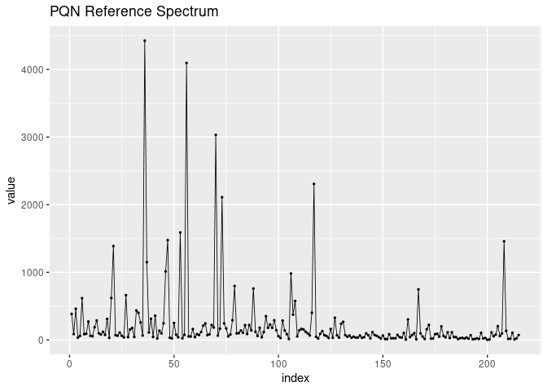
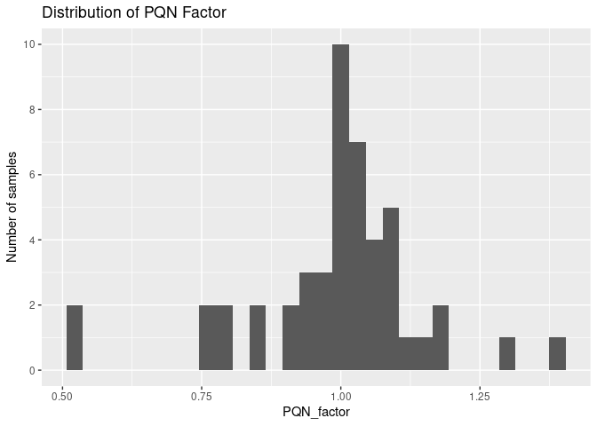
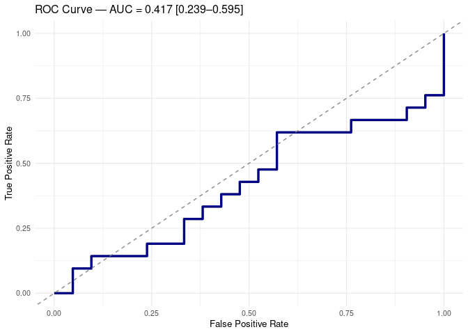
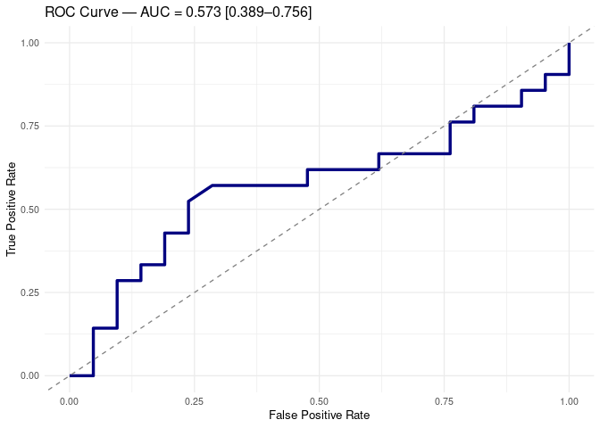

Full Untargeted Analysis of Tarragona Samples
================
Tecla Duran Fort
2025-12-22

- <a href="#1-set-up" id="toc-1-set-up">1 Set Up</a>
- <a href="#2-load-data" id="toc-2-load-data">2 Load Data</a>
  - <a href="#21-gcims-peak-table" id="toc-21-gcims-peak-table">2.1 GCIMS
    Peak table</a>
  - <a href="#22-metadata" id="toc-22-metadata">2.2 Metadata</a>
- <a href="#3-preprocessing" id="toc-3-preprocessing">3 Preprocessing</a>
  - <a href="#31-pqn-normalisation" id="toc-31-pqn-normalisation">3.1 PQN
    Normalisation</a>
  - <a href="#32-log-transformation" id="toc-32-log-transformation">3.2 Log
    Transformation</a>
- <a href="#4-exploratory-analysis" id="toc-4-exploratory-analysis">4
  Exploratory Analysis</a>
- <a href="#5-classification-performance"
  id="toc-5-classification-performance">5 Classification Performance</a>
  - <a href="#51-pls-da" id="toc-51-pls-da">5.1 PLS-DA</a>
    - <a href="#511-data-preparation" id="toc-511-data-preparation">5.1.1 Data
      Preparation</a>
    - <a href="#512-training" id="toc-512-training">5.1.2 Training</a>
    - <a href="#513-results" id="toc-513-results">5.1.3 Results</a>
  - <a href="#52-random-forest" id="toc-52-random-forest">5.2 Random
    Forest</a>
    - <a href="#521-adding-metadata-as-predictors"
      id="toc-521-adding-metadata-as-predictors">5.2.1 Adding Metadata as
      Predictors</a>

# 1 Set Up

# 2 Load Data

## 2.1 GCIMS Peak table

The loaded dataset contains only the **patient samples** and has already
been [filtered based on cluster
representation](https://github.com/tecladuran/targetml-gcims-tools/blob/main/docs/Untargeted_Old_New/cluster_filtering_summary.md)

``` r
data <- read_csv("data/tables/22_campaign/patient_data_filtered.csv")
cluster_cols <- grep("^Cluster", names(data), value = TRUE)
```

## 2.2 Metadata

``` r
metadata_old<-read_csv("data/tables/22_campaign/metadata_old_samples.csv")
metadata_new <- read_csv("data/tables/tgn/tgn_metadata.csv")

# Clean datasets to compare
metadata_old_clean <- metadata_old %>%
  rename(
    patient_id = ID,
    sex = SEX,
    age = AGE,
    bmi = BMI
  ) %>%
  mutate(patient_id = as.integer(patient_id))

metadata_new_clean <- metadata_new %>%
  mutate(patient_id = as.integer(patient_id)) %>%
  select(-condition)
# Bind both without repeating patients
metadata_full <- bind_rows(metadata_new_clean, metadata_old_clean) %>%
  distinct(patient_id, .keep_all = TRUE)

# Only the ones that are measured with GCIMS

# data (gcims) has patient_id column

metadata <- data %>%
  select(patient_id) %>%      
  distinct() %>%                   
  left_join(metadata_full, by = "patient_id")
```

# 3 Preprocessing

## 3.1 PQN Normalisation

``` r
ref_spectrum <- data %>%
  select(starts_with("Cluster")) %>%
  summarise(across(everything(), median, na.rm = TRUE)) %>%
  as.numeric()
```

``` r
df_plot <- data.frame(
  index = seq_along(ref_spectrum),
  value = ref_spectrum
)

# Gràfic de línia
ggplot(df_plot, aes(x = index, y = value)) +
  geom_point(size=0.5)+
  geom_line(linewidth=0.3)+
  ggtitle("PQN Reference Spectrum")
```

<!-- -->

``` r
df_norm<- data %>%
  mutate(across(starts_with("Cluster"), as.numeric)) %>%
  group_split(row_number()) %>%                     # Split into individual samples
  map_dfr(function(row_df) {
    # Extract numeric cluster values for the current sample
    x <- as.numeric(row_df %>%
                      select(starts_with("Cluster")))
    
    # Compute the ratio between sample and reference spectrum
    quotients <- x / ref_spectrum
    quotients <- quotients[is.finite(quotients)]    # Remove non-finite values
    
    # Median of quotients = normalization factor
    f <- median(quotients, na.rm = TRUE)
    
    # Apply normalization and store the factor
    row_df %>%
      mutate(across(starts_with("Cluster"), ~ .x / f),
             PQN_factor = f)
  })
```

``` r
ggplot(df_norm, aes(x = PQN_factor)) +
  geom_histogram() +
  ggtitle("Distribution of PQN Factor") +
  ylab("Number of samples") +
  scale_y_continuous(breaks = scales::pretty_breaks())
```

<!-- -->

## 3.2 Log Transformation

``` r
# ---- LOG-TRANSFORM ----
data_log <- df_norm
data_log[cluster_cols] <- log1p(data_log[cluster_cols])
```

# 4 Exploratory Analysis

``` r
# Simple PCA score plot function
plot_pca <- function(data, labels, levels, colors) {
  
  # Select only cluster columns (numerical features)
  features <- data[, grepl("^Cluster", colnames(data))]
  
  # Run PCA
  pca_res <- prcomp(features, scale. = TRUE)
  
  # Build score dataframe
  scores <- as.data.frame(pca_res$x[, 1:2])   # PC1 + PC2
  scores$label <- factor(labels, levels = levels)
  
  # Simple shapes for the two groups
  shapes <- c(16, 17, 18)  
  
  # Score plot
  ggplot(scores, aes(PC1, PC2, color = label, shape = label)) +
    geom_point(size = 3, alpha = 0.8) +
    scale_color_manual(values = colors) +
    scale_shape_manual(values = shapes) +
    theme_minimal(base_size = 14) +
    labs(title = "PCA Score Plot", x = "PC1", y = "PC2")
}
```

``` r
group_labels <- data_log$patient_condition
group_levels <- levels(as.factor(group_labels))
group_colors <- c(
  "#337B9F",   # nivell 1
  "#C83342",   # nivell 2
  "darkgreen"  # nivell 3
)
names(group_colors) <- group_levels


p <- plot_pca(data_log, group_labels, group_levels, group_colors)

print(p)
```

<!-- -->

``` r
# PICK ONLY CRC AND CTRL SAMPLES
df <- data_log %>% 
  filter(patient_condition %in% c("CRC", "CTRL"))
```

# 5 Classification Performance

## 5.1 PLS-DA

### 5.1.1 Data Preparation

``` r
# Predictor matrix
X <- df[, cluster_cols] %>% as.matrix()

# Response variable
y <- df$patient_condition

set.seed(123)
```

### 5.1.2 Training

``` r
plsda_res <- plsda_nested_cv_rfe(
  X = X,
  y = y,
  positive_class = "CRC",
  negative_class = "CTRL",
  outer_folds = 7,
  inner_folds = 6,
  ncomp_max = 10
)
```

### 5.1.3 Results

``` r
show_results(plsda_res, title = "PLS-DA CV — GC-IMS Classification")
```

    ## ### PLS-DA CV — GC-IMS Classification 
    ## Overall Leave-One-Out Accuracy: 0.452 
    ## 
    ## 
    ## 
    ## Table: Global Confusion Matrix (Aggregated Across All LOO Iterations).
    ## 
    ## |   |  0|  1|
    ## |:--|--:|--:|
    ## |0  |  9| 12|
    ## |1  | 11| 10|

<!-- -->

## 5.2 Random Forest

### 5.2.1 Adding Metadata as Predictors

``` r
# Add Metadata in the predictor matrix

df_meta <- df %>%
  left_join(metadata, by = "patient_id")

# 2. Construct predictor matrix X
# (remove response variable and ID if needed)
X <- df_meta %>%
  select(-patient_condition, -patient_id) 

# 3. Response variable
y <- df_meta$patient_condition
```

``` r
rf_res <- rf_nested_cv_rfe(
  X = X,
  y = y,
  positive_class = "CRC",
  negative_class = "CTRL",
  outer_folds = 7,
  inner_folds = 6,
  ntree = 500,
  mtry_grid = c(2, 4, 6),
  strat_vars = NULL
)
```

``` r
show_results(rf_res, title = "Random Forest Nested CV — GC-IMS Classification")
```

    ## ### Random Forest Nested CV — GC-IMS Classification 
    ## Overall Leave-One-Out Accuracy: 0.571 
    ## 
    ## 
    ## 
    ## Table: Global Confusion Matrix (Aggregated Across All LOO Iterations).
    ## 
    ## |   |  0|  1|
    ## |:--|--:|--:|
    ## |0  | 12|  9|
    ## |1  |  9| 12|

<!-- -->
