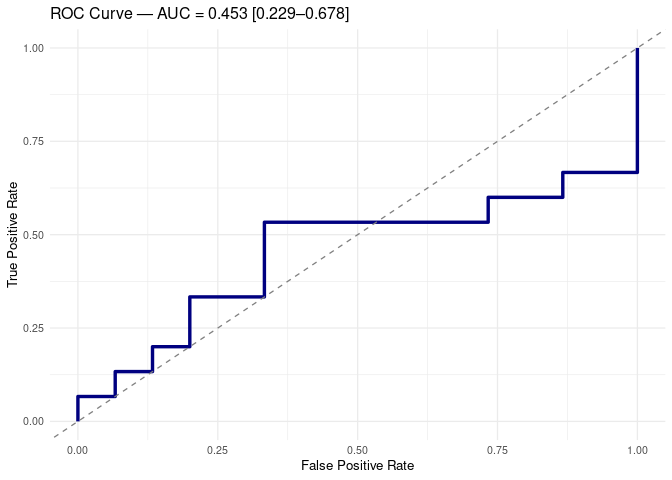

Full Untargeted Analysis of Tarragona Samples
================
Tecla Duran Fort
2025-12-23

- <a href="#1-set-up" id="toc-1-set-up">1 Set Up</a>
- <a href="#2-load-data" id="toc-2-load-data">2 Load Data</a>
  - <a href="#21-loading-full-gcims-peak-table"
    id="toc-21-loading-full-gcims-peak-table">2.1 Loading Full GCIMS Peak
    table</a>
- <a href="#3-preprocessing" id="toc-3-preprocessing">3 Preprocessing</a>
  - <a href="#31-creatinine-normalisation"
    id="toc-31-creatinine-normalisation">3.1 Creatinine Normalisation</a>
  - <a href="#32-log-transformation" id="toc-32-log-transformation">3.2 Log
    Transformation</a>
- <a href="#4-exploratory-analysis" id="toc-4-exploratory-analysis">4
  Exploratory Analysis</a>
- <a href="#5-classification-performance"
  id="toc-5-classification-performance">5 Classification Performance</a>
  - <a href="#51-functions-definition" id="toc-51-functions-definition">5.1
    Functions Definition</a>
    - <a href="#511-make-stratified-folds"
      id="toc-511-make-stratified-folds">5.1.1 Make Stratified Folds</a>
    - <a href="#512-nested-cross-validation"
      id="toc-512-nested-cross-validation">5.1.2 Nested Cross Validation</a>
  - <a href="#52-evaluation" id="toc-52-evaluation">5.2 Evaluation</a>

# 1 Set Up

# 2 Load Data

## 2.1 Loading Full GCIMS Peak table

The loaded dataset contains only the **patient samples** and has already
been [filtered based on cluster representation and RSD]()

``` r
data <- read_csv("data/tables/tgn_gcims/peak_table_filtered_patients.csv")
creatinine<- read_csv("data/tables/tgn/creatinine.csv") 
cluster_cols <- grep("^Cluster", names(data), value = TRUE)
```

# 3 Preprocessing

## 3.1 Creatinine Normalisation

``` r
creatinine <- creatinine %>%
  slice(1:(n() - 2)) %>%          # (two last not corresponding to patients)
  mutate(ID = as.numeric(ID))%>%
  rename(Creatinine = Creatinine_mg_dl)

# Join by patient_id
df <- data %>%
  left_join(creatinine, by = c("patient_id" = "ID"))
```

``` r
# Normalise cluster intensities by creatinine
df_creatinine_norm <- df %>%
  mutate(across(all_of(cluster_cols), ~ .x / Creatinine))
```

## 3.2 Log Transformation

``` r
# ---- LOG-TRANSFORM ----
data_log <- df_creatinine_norm
data_log[cluster_cols] <- log1p(data_log[cluster_cols])
```

# 4 Exploratory Analysis

``` r
# Simple PCA score plot function
plot_pca <- function(data, labels, levels, colors) {
  
  # Select only cluster columns (numerical features)
  features <- data[, grepl("^Cluster", colnames(data))]
  
  # Run PCA
  pca_res <- prcomp(features, scale. = TRUE)
  
  # Build score dataframe
  scores <- as.data.frame(pca_res$x[, 1:2])   # PC1 + PC2
  scores$label <- factor(labels, levels = levels)
  
  # Simple shapes for the two groups
  shapes <- c(16, 17)   # circle, triangle
  
  # Score plot
  ggplot(scores, aes(PC1, PC2, color = label, shape = label)) +
    geom_point(size = 3, alpha = 0.8) +
    scale_color_manual(values = colors) +
    scale_shape_manual(values = shapes) +
    theme_minimal(base_size = 14) +
    labs(title = "PCA Score Plot", x = "PC1", y = "PC2")
}
```

``` r
group_labels <- df_creatinine_norm$patient_condition
group_levels <- c("CTRL", "CRC")
group_colors <- c("CTRL" = "#337B9F", "CRC" = "#C83342")

p <- plot_pca(data_log, group_labels, group_levels, group_colors)

print(p)
```

<!-- -->

# 5 Classification Performance

## 5.1 Functions Definition

### 5.1.1 Make Stratified Folds

``` r
make_folds <- function(..., k) {
  set.seed(1)
  folds <- vector("list", k)
  
  # Capture all input variables as a data frame
  vars <- list(...)
  if (length(vars) == 0) stop("You must provide at least one variable for stratification.")
  
  # Combine all variables into one data frame
  df <- as.data.frame(vars)
  
  # Create stratification factor (interaction between all variables)
  strata <- interaction(df, drop = TRUE)
  
  # Create folds maintaining proportional representation of each stratum
  for (lvl in levels(strata)) {
    idx <- which(strata == lvl)
    idx <- sample(idx)
    split_idx <- cut(seq_along(idx), breaks = k, labels = FALSE)
    for (i in 1:k) {
      folds[[i]] <- c(folds[[i]], idx[split_idx == i])
    }
  }
  
  return(folds)
}
```

### 5.1.2 Nested Cross Validation

``` r
plsda_nested_cv_rfe <- function(X, y, positive_class, negative_class, 
                                ncomp_max = 10, outer_folds = 5, inner_folds = 4) {
  
  y <- factor(y, levels = c(negative_class, positive_class))
  y_num <- ifelse(y == positive_class, 1, 0)
  
  outer_folds_idx <- make_folds(y, k=outer_folds)
  
  # --- PARALLEL OUTER LOOP ---
  results <- bplapply(seq_along(outer_folds_idx), function(o) {
    
    test_id <- outer_folds_idx[[o]]
    train_id <- setdiff(seq_along(y), test_id)
    
    X_train <- X[train_id, , drop = FALSE]
    y_train <- y[train_id]
    y_train_num <- y_num[train_id]
    X_test  <- X[test_id, , drop = FALSE]
    y_test  <- y[test_id]
    y_test_num <- y_num[test_id]
    
    features <- colnames(X_train)
    best_acc <- 0
    best_features <- features
    
    internal_acc_history <- data.frame()
    external_acc_history <- data.frame()
    
    repeat {
      inner_idx <- make_folds(y_train, k=inner_folds)
      acc_mat <- matrix(NA, nrow = inner_folds, ncol = ncomp_max)
      
      # --- INNER CV --------
      for (f in seq_along(inner_idx)) {
        val_id <- inner_idx[[f]]
        tr_id  <- setdiff(seq_along(y_train), val_id)
        
        Xi_tr <- X_train[tr_id, features, drop = FALSE]
        yi_tr <- y_train_num[tr_id]
        Xi_val <- X_train[val_id, features, drop = FALSE]
        yi_val <- y_train_num[val_id]
        
        model <- plsr(y ~ ., data = data.frame(y = yi_tr, Xi_tr),
                      ncomp = ncomp_max, method = "oscorespls", scale = TRUE)
        
        preds <- predict(model, newdata = Xi_val, ncomp = 1:ncomp_max)
        preds_mat <- matrix(preds, nrow = length(yi_val), ncol = ncomp_max)
        
        acc_mat[f, ] <- colMeans((preds_mat > 0.5) == yi_val)
      }
      
      mean_acc <- colMeans(acc_mat, na.rm = TRUE)
      opt_ncomp <- which.max(mean_acc)
      
      internal_acc_history <- rbind(
        internal_acc_history,
        data.frame(Nfeatures = length(features), Accuracy = max(mean_acc))
      )
      
      # Train full model
      model_full <- plsr(y ~ ., data = data.frame(y = y_train_num, 
                                                  X_train[, features, drop = FALSE]),
                         ncomp = opt_ncomp, method = "oscorespls", scale = TRUE)
      
      test_pred <- predict(model_full, X_test[, features, drop = FALSE], ncomp = opt_ncomp)
      test_class <- as.integer(test_pred > 0.5)
      acc_ext <- mean(test_class == y_test_num)
      
      external_acc_history <- rbind(
        external_acc_history,
        data.frame(Nfeatures = length(features), Accuracy = acc_ext)
      )
      
      if (max(mean_acc) > best_acc) {
        best_acc <- max(mean_acc)
        best_features <- features
        best_ncomp <- opt_ncomp
      }
      
      if (length(features) <= 10) break
      
      vip <- plsVarSel::VIP(model_full, opt.comp = opt_ncomp)
      drop_n <- max(1, ceiling(length(features) * 0.05))
      drop_feat <- names(sort(vip))[1:drop_n]
      features <- setdiff(features, drop_feat)
    }
    
    # Final model
    final_model <- plsr(
      y ~ ., 
      data = data.frame(y = y_train_num, X_train[, best_features, drop = FALSE]),
      ncomp = best_ncomp, method = "oscorespls", scale = TRUE
    )
    
    test_pred <- predict(final_model, X_test[, best_features, drop = FALSE], ncomp = best_ncomp)
    
    predictions <- data.frame(
      SampleIndex = test_id,
      TrueLabel = y_test_num,
      PredProb = as.numeric(test_pred),
      PredClass = as.integer(test_pred > 0.5),
      ncomp = best_ncomp
    )
    
    list(
      ncomp = best_ncomp,
      best_features = best_features,
      internal_acc_history = internal_acc_history,
      external_acc_history = external_acc_history,
      predictions = predictions
    )
  })
  
  # --- Collate predictions globally ---
  preds_all <- do.call(rbind, lapply(results, function(x) x$predictions))
  overall_acc <- mean(preds_all$TrueLabel == preds_all$PredClass)
  
  return(list(
    results = results,
    predictions = preds_all,
    overall_accuracy = overall_acc
  ))
}
```

## 5.2 Evaluation

``` r
# Predictor matrix
X <- data_log[, cluster_cols] %>% as.matrix()

# Response variable
y <- data_log$patient_condition
```

``` r
set.seed(123)

plsda_res <- plsda_nested_cv_rfe(
  X = X,
  y = y,
  positive_class = "CRC",
  negative_class = "CTRL",
  outer_folds = 6,
  inner_folds = 5,
  ncomp_max = 10
)
```

``` r
show_results(plsda_res, title = "PLSDA Nested CV — GC-IMS Classification")
```

    ## ### PLSDA Nested CV — GC-IMS Classification 
    ## Overall Leave-One-Out Accuracy: 0.6 
    ## 
    ## 
    ## 
    ## Table: Global Confusion Matrix (Aggregated Across All LOO Iterations).
    ## 
    ## |   |  0|  1|
    ## |:--|--:|--:|
    ## |0  | 10|  5|
    ## |1  |  7|  8|

<!-- -->
