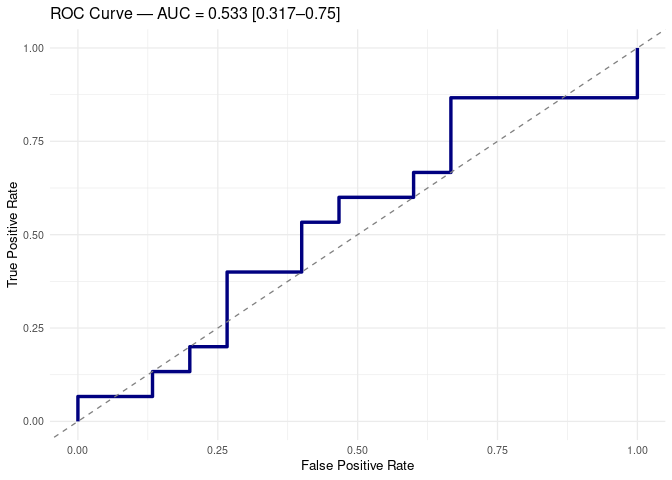

Full Untargeted Analysis of Tarragona Samples
================
Tecla Duran Fort
2025-12-22

- <a href="#1-set-up" id="toc-1-set-up">1 Set Up</a>
- <a href="#2-load-data" id="toc-2-load-data">2 Load Data</a>
  - <a href="#21-loading-full-gcims-peak-table"
    id="toc-21-loading-full-gcims-peak-table">2.1 Loading Full GCIMS Peak
    table</a>
- <a href="#3-preprocessing" id="toc-3-preprocessing">3 Preprocessing</a>
  - <a href="#31-creatinine-normalisation"
    id="toc-31-creatinine-normalisation">3.1 Creatinine Normalisation</a>
  - <a href="#32-log-transformation" id="toc-32-log-transformation">3.2 Log
    Transformation</a>
- <a href="#4-exploratory-analysis" id="toc-4-exploratory-analysis">4
  Exploratory Analysis</a>
- <a href="#5-classification-performance"
  id="toc-5-classification-performance">5 Classification Performance</a>
  - <a href="#51-functions-definition" id="toc-51-functions-definition">5.1
    Functions Definition</a>
    - <a href="#511-make-stratified-folds"
      id="toc-511-make-stratified-folds">5.1.1 Make Stratified Folds</a>
    - <a href="#512-nested-cross-validation"
      id="toc-512-nested-cross-validation">5.1.2 Nested Cross Validation</a>
  - <a href="#52-evaluation" id="toc-52-evaluation">5.2 Evaluation</a>

# 1 Set Up

# 2 Load Data

## 2.1 Loading Full GCIMS Peak table

The loaded dataset contains only the **patient samples** and has already
been [filtered based on cluster representation and RSD]()

``` r
data <- read_csv("data/tables/tgn_gcims/peak_table_filtered_patients.csv")
creatinine<- read_csv("data/tables/tgn/creatinine.csv") 
cluster_cols <- grep("^Cluster", names(data), value = TRUE)
```

# 3 Preprocessing

## 3.1 Creatinine Normalisation

``` r
creatinine <- creatinine %>%
  slice(1:(n() - 2)) %>%          # (two last not corresponding to patients)
  mutate(ID = as.numeric(ID))%>%
  rename(Creatinine = Creatinine_mg_dl)

# Join by patient_id
df <- data %>%
  left_join(creatinine, by = c("patient_id" = "ID"))
```

``` r
# Normalise cluster intensities by creatinine
df_creatinine_norm <- df %>%
  mutate(across(all_of(cluster_cols), ~ .x / Creatinine))
```

## 3.2 Log Transformation

``` r
# ---- LOG-TRANSFORM ----
data_log <- df_creatinine_norm
data_log[cluster_cols] <- log1p(data_log[cluster_cols])
```

# 4 Exploratory Analysis

``` r
# Simple PCA score plot function
plot_pca <- function(data, labels, levels, colors) {
  
  # Select only cluster columns (numerical features)
  features <- data[, grepl("^Cluster", colnames(data))]
  
  # Run PCA
  pca_res <- prcomp(features, scale. = TRUE)
  
  # Build score dataframe
  scores <- as.data.frame(pca_res$x[, 1:2])   # PC1 + PC2
  scores$label <- factor(labels, levels = levels)
  
  # Simple shapes for the two groups
  shapes <- c(16, 17)   # circle, triangle
  
  # Score plot
  ggplot(scores, aes(PC1, PC2, color = label, shape = label)) +
    geom_point(size = 3, alpha = 0.8) +
    scale_color_manual(values = colors) +
    scale_shape_manual(values = shapes) +
    theme_minimal(base_size = 14) +
    labs(title = "PCA Score Plot", x = "PC1", y = "PC2")
}
```

``` r
group_labels <- df_creatinine_norm$patient_condition
group_levels <- c("CTRL", "CRC")
group_colors <- c("CTRL" = "#337B9F", "CRC" = "#C83342")

p <- plot_pca(data_log, group_labels, group_levels, group_colors)

print(p)
```

<!-- -->

# 5 Classification Performance

## 5.1 Functions Definition

### 5.1.1 Make Stratified Folds

``` r
make_folds <- function(..., k) {
  set.seed(1)
  folds <- vector("list", k)
  
  # Capture all input variables as a data frame
  vars <- list(...)
  if (length(vars) == 0) stop("You must provide at least one variable for stratification.")
  
  # Combine all variables into one data frame
  df <- as.data.frame(vars)
  
  # Create stratification factor (interaction between all variables)
  strata <- interaction(df, drop = TRUE)
  
  # Create folds maintaining proportional representation of each stratum
  for (lvl in levels(strata)) {
    idx <- which(strata == lvl)
    idx <- sample(idx)
    split_idx <- cut(seq_along(idx), breaks = k, labels = FALSE)
    for (i in 1:k) {
      folds[[i]] <- c(folds[[i]], idx[split_idx == i])
    }
  }
  
  return(folds)
}
```

### 5.1.2 Nested Cross Validation

``` r
rf_nested_cv <- function(X, y, positive_class, negative_class,
                         outer_folds = 5, inner_folds = 4,
                         ntree = 500, mtry_grid = c(2, 4, 6),
                         strat_vars = NULL,
                         workers_outer = max(1, parallel::detectCores() - 2),
                         workers_inner = max(1, parallel::detectCores() - 2)) {
  
  library(randomForest)
  library(BiocParallel)
  
  # Paral·lelització outer folds
  bp_outer <- MulticoreParam(workers = workers_outer, progressbar = TRUE)
  
  # Paral·lelització inner folds
  bp_inner <- MulticoreParam(workers = workers_inner, progressbar = FALSE)
  
  y <- factor(y, levels = c(negative_class, positive_class))
  
  # --- Càlcul dels outer folds (seqüencial per obtenir indices) ---
  if (is.null(strat_vars)) {
    outer_folds_idx <- make_folds(y, k = outer_folds)
  } else {
    outer_folds_idx <- do.call(make_folds, c(list(y), strat_vars, k = outer_folds))
  }
  
  # --- LOOP OUTER EN PARA·LEL ---
  outer_results <- bplapply(seq_along(outer_folds_idx), function(o) {
    
    test_id <- outer_folds_idx[[o]]
    train_id <- setdiff(seq_along(y), test_id)
    
    X_train <- X[train_id, , drop = FALSE]
    y_train <- y[train_id]
    X_test  <- X[test_id, , drop = FALSE]
    y_test  <- y[test_id]
    
    # --- Inner folds per tuning ---
    if (is.null(strat_vars)) {
      inner_folds_idx <- make_folds(y_train, k = inner_folds)
    } else {
      strat_train <- lapply(strat_vars, function(v) v[train_id])
      inner_folds_idx <- do.call(make_folds, c(list(y_train), strat_train, k = inner_folds))
    }
    
    inner_acc <- numeric(length(mtry_grid))
    
    # Per cada mtry, paral·lelitzar els inner folds
    for (m in seq_along(mtry_grid)) {
      
      acc_list <- bplapply(seq_along(inner_folds_idx), function(f) {
        
        inner_test <- inner_folds_idx[[f]]
        inner_train <- setdiff(seq_along(y_train), inner_test)
        
        rf_inner <- randomForest(
          x = X_train[inner_train, , drop = FALSE],
          y = factor(y_train[inner_train], levels = c(negative_class, positive_class)),
          ntree = ntree,
          mtry = mtry_grid[m]
        )
        
        pred_inner <- predict(rf_inner, newdata = X_train[inner_test, , drop = FALSE])
        mean(pred_inner == y_train[inner_test])
        
      }, BPPARAM = bp_inner)
      
      inner_acc[m] <- mean(unlist(acc_list))
    }
    
    best_mtry <- mtry_grid[which.max(inner_acc)]
    
    # --- Model final ---
    rf_final <- randomForest(
      x = X_train,
      y = y_train,
      ntree = ntree,
      mtry = best_mtry,
      importance = TRUE
    )
    
    prob_mat <- predict(rf_final, newdata = X_test, type = "prob")
    pred_prob <- prob_mat[, positive_class]
    pred_class <- ifelse(pred_prob > 0.5, 1, 0)
    true_class <- ifelse(y_test == positive_class, 1, 0)
    
    list(
      results = list(
        best_mtry = best_mtry,
        inner_acc = inner_acc,
        model = rf_final
      ),
      preds = data.frame(
        SampleIndex = test_id,
        TrueLabel = true_class,
        PredProb = pred_prob,
        PredClass = pred_class
      )
    )
    
  }, BPPARAM = bp_outer)
  
  # --- Combinar resultats ---
  results_list <- lapply(outer_results, `[[`, "results")
  preds_all <- do.call(rbind, lapply(outer_results, `[[`, "preds"))
  
  overall_acc <- mean(preds_all$TrueLabel == preds_all$PredClass)
  
  list(
    results = results_list,
    predictions = preds_all,
    overall_accuracy = overall_acc
  )
}
```

## 5.2 Evaluation

``` r
# Predictor matrix
X <- data_log[, cluster_cols] %>% as.matrix()

# Response variable
y <- data_log$patient_condition
```

``` r
set.seed(123)

rf_res <- rf_nested_cv(
  X = X,
  y = y,
  positive_class = "CRC",
  negative_class = "CTRL",
  outer_folds = 7,
  inner_folds = 6,
  ntree = 500,
  mtry_grid = c(2, 4, 6),
  strat_vars = NULL    
)
```

    ##   |                                                                              |                                                                      |   0%  |                                                                              |==========                                                            |  14%  |                                                                              |====================                                                  |  29%  |                                                                              |==============================                                        |  43%  |                                                                              |========================================                              |  57%  |                                                                              |==================================================                    |  71%  |                                                                              |============================================================          |  86%  |                                                                              |======================================================================| 100%

``` r
show_results(rf_res, title = "Random Forest Nested CV — GC-IMS Classification")
```

    ## ### Random Forest Nested CV — GC-IMS Classification 
    ## Overall Leave-One-Out Accuracy: 0.533 
    ## 
    ## 
    ## 
    ## Table: Global Confusion Matrix (Aggregated Across All LOO Iterations).
    ## 
    ## |   |  0|  1|
    ## |:--|--:|--:|
    ## |0  |  8|  7|
    ## |1  |  7|  8|

<!-- -->
